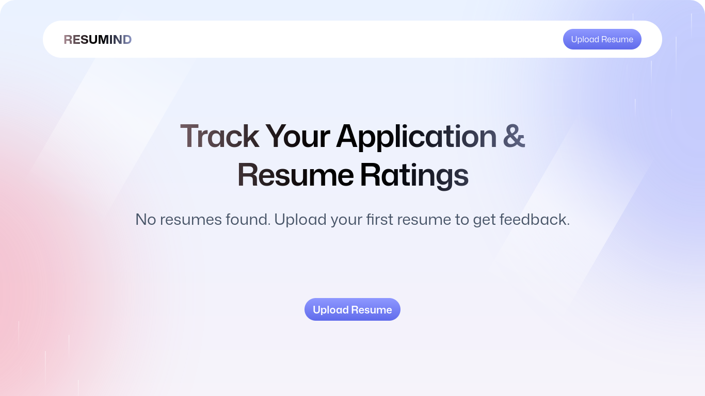

# ResuMind --- AI‑Powered Resume Analyzer


> A modern, server‑rendered **AI Resume Analyzer** built with **React
> Router v7 Full‑Stack**, **TypeScript**, and **TailwindCSS** ---
> supporting PDF parsing, ATS scoring, resume insights, and PWA
> features.

------------------------------------------------------------------------

## 🚀 Overview

**ResuMind** is a full‑stack React Router (v7) application that helps
users upload resumes (PDF), converts them into images, extracts text,
and generates AI‑powered insights & ATS score.

This project focuses on:

-   Full‑stack React Router architecture (loaders/actions/server routes)
-   PDF → Image processing using `pdfjs-dist`
-   ATS scoring & structured evaluation
-   Clean, modern UI with TailwindCSS
-   Global state using Zustand
-   Drag‑and‑drop resume upload
-   PWA support (manifest + icons)
-   Optimized static assets

------------------------------------------------------------------------

## 🖥️ Project Screenshot

> Desktop Preview\
> *(Replace this with your screenshot later)*



------------------------------------------------------------------------

## 📁 Folder Structure

``` bash
.
├── app
│   ├── app.css
│   ├── components
│   │   ├── Accordian.tsx
│   │   ├── ATS.tsx
│   │   ├── Details.tsx
│   │   ├── FileUploader.tsx
│   │   ├── Navbar.tsx
│   │   ├── ResumeCard.tsx
│   │   ├── ScoreBadge.tsx
│   │   ├── ScoreCircle.tsx
│   │   ├── ScoreGauge.tsx
│   │   └── Summary.tsx
│   ├── lib
│   │   ├── index.ts
│   │   ├── pdf2img.ts
│   │   ├── puter.ts
│   │   └── utils.ts
│   ├── root.tsx
│   ├── routes
│   │   ├── auth.tsx
│   │   ├── home.tsx
│   │   ├── resume.tsx
│   │   ├── upload.tsx
│   │   └── wipe.tsx
│   └── routes.ts
├── constants
│   ├── AIResponseFormat.ts
│   ├── index.ts
│   └── prepareInstructions.ts
├── Dockerfile
├── package.json
├── public
│   ├── icons
│   ├── images
│   ├── manifest.json
│   └── pdf.worker.min.mjs
├── react-router.config.ts
├── tsconfig.json
├── types
├── vite.config.ts
└── README.md
```

------------------------------------------------------------------------

## 🛠️ Tech Stack

### **Frontend / Fullstack**

-   React 19
-   React Router v7 Full‑Stack
-   TypeScript
-   Zustand
-   TailwindCSS 4
-   Vite 7

### **PDF & Utility**

-   pdfjs‑dist (PDF → Image extract)
-   clsx
-   tailwind‑merge

### **Deployment**

-   Docker
-   GitHub Actions

------------------------------------------------------------------------

## ⚙️ Scripts

``` json
{
  "build": "react-router build",
  "dev": "react-router dev",
  "start": "react-router-serve ./build/server/index.js",
  "typecheck": "react-router typegen && tsc"
}
```

------------------------------------------------------------------------

## 📦 Installation & Setup

``` bash
git clone https://github.com/grep-many/resumind.git
cd resumind
npm install
npm run dev
```

------------------------------------------------------------------------

## 🪪 License

[](./LICENSE)

This project is open-sourced under the MIT License © 2025 Manish.